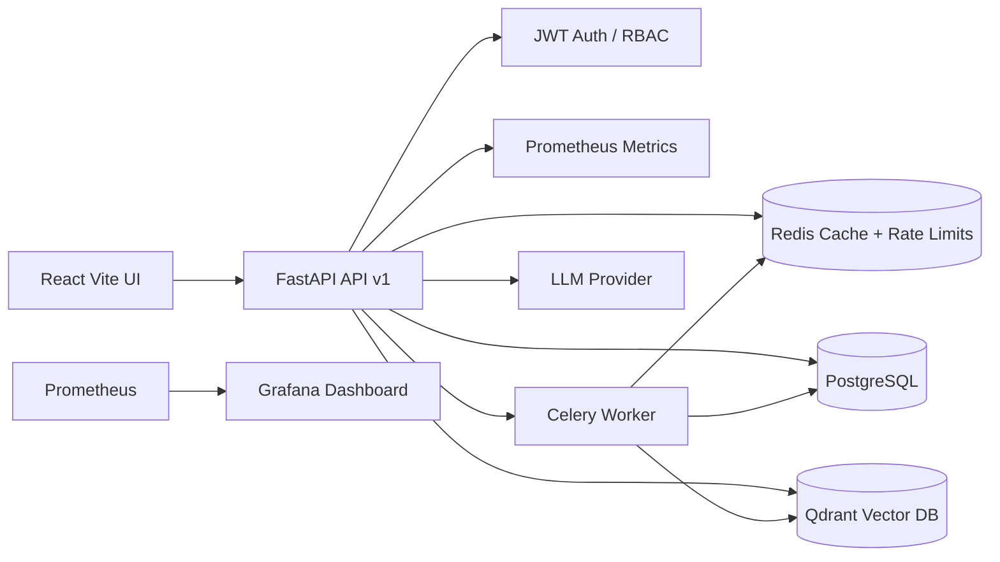

# Athena AI Engineering Copilot

Athena is a production-style internal AI platform for a quantitative trading firm. It gives engineers, quantitative researchers, and operations teams one place to search runbooks and research notes, index code and documents, ask LLM-backed questions with source citations, and observe AI/product health.

## What Is Included

- FastAPI backend with async SQLAlchemy, PostgreSQL, Alembic, Redis, Celery, JWT auth, Pydantic v2, request IDs, structured logging, rate limiting, Prometheus metrics, and API versioning.
- RAG pipeline for PDFs, Markdown, TXT, and source code: validation, extraction, chunking, embeddings, Qdrant vector storage, semantic search, streaming answers, prompt templates, citations, memory, usage tracking, and background indexing.
- React + Vite frontend with TailwindCSS: login, chat, document management, admin dashboard, and metrics dashboard.
- Docker Compose stack for PostgreSQL, Redis, Qdrant, FastAPI, Celery worker, Prometheus, Grafana, and frontend.
- CI with Ruff, Black, Mypy, Pytest, and frontend build.

## Architecture



## Quick Start

```bash
cp .env.example .env
docker compose up --build
```

Services:

- API: http://localhost:8000/docs
- Frontend: http://localhost:5173
- Prometheus: http://localhost:9090
- Grafana: http://localhost:3000 (`admin` / `admin`)
- Qdrant: http://localhost:6333/dashboard

Seed demo data:

```bash
docker compose exec api python scripts/seed.py
```

Default seeded users:

- `admin@athena.local` / `AthenaAdmin123!`
- `researcher@athena.local` / `AthenaResearch123!`

## Local Backend Development

```bash
cd backend
python -m venv .venv
.venv\Scripts\activate
pip install -e ".[dev]"
alembic upgrade head
uvicorn app.main:app --reload
```

Run tests:

```bash
cd backend
pytest
```

## Example Requests

Register:

```bash
curl -X POST http://localhost:8000/api/v1/auth/register \
  -H "Content-Type: application/json" \
  -d '{"email":"dev@athena.local","password":"StrongPass123!","full_name":"Dev User"}'
```

Login:

```bash
curl -X POST http://localhost:8000/api/v1/auth/login \
  -H "Content-Type: application/json" \
  -d '{"email":"dev@athena.local","password":"StrongPass123!"}'
```

Upload a document:

```bash
curl -X POST http://localhost:8000/api/v1/documents \
  -H "Authorization: Bearer $TOKEN" \
  -F "file=@docs/runbook.md" \
  -F "title=Trading Runbook"
```

Ask a question:

```bash
curl -N -X POST http://localhost:8000/api/v1/ai/ask \
  -H "Authorization: Bearer $TOKEN" \
  -H "Content-Type: application/json" \
  -d '{"question":"How do I restart market data ingestion?","stream":true}'
```

## API Surface

- `POST /api/v1/auth/register`
- `POST /api/v1/auth/login`
- `GET /api/v1/auth/me`
- `POST /api/v1/documents`
- `GET /api/v1/documents`
- `POST /api/v1/documents/{document_id}/index`
- `GET /api/v1/search?query=...`
- `POST /api/v1/ai/ask`
- `GET /api/v1/chat/conversations`
- `GET /api/v1/usage/me`
- `GET /api/v1/admin/users`
- `GET /api/v1/admin/usage`
- `GET /health`
- `GET /ready`
- `GET /metrics`

## Documentation

- [Architecture](docs/architecture.md)
- [API Documentation](docs/api.md)
- [Sequence Diagrams](docs/sequences.md)
- [ER Diagram](docs/er-diagram.md)
- [Screenshots](docs/screenshots.md)

## Production Notes

The default demo configuration uses deterministic local embeddings and a local extractive LLM provider so the system is runnable without secrets. Set `LLM_PROVIDER=openai`, `EMBEDDING_PROVIDER=openai`, and `OPENAI_API_KEY` to use a hosted model provider in real environments.

