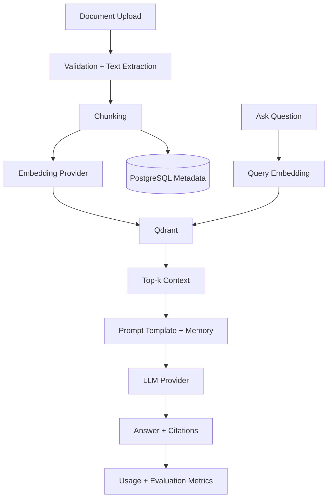

# Architecture

Athena is organized as a monorepo with clear runtime boundaries:

- `backend/app/api`: versioned FastAPI route adapters.
- `backend/app/services`: application use cases such as auth, document indexing, RAG, and LLM interaction.
- `backend/app/repositories`: persistence adapters over SQLAlchemy models.
- `backend/app/tasks`: Celery task entry points for background indexing.
- `frontend/src`: React UI for chat, document management, admin, and metrics.
- `infra`: Prometheus and Grafana provisioning.

## Clean Architecture Boundaries

Routes translate HTTP into typed service calls. Services own workflow and policy. Repositories own data access. Provider classes isolate infrastructure details for Qdrant, Redis, and LLM/embedding APIs.

## Failure Handling

All API exceptions include a request ID. Known domain errors return typed HTTP status codes. Unhandled exceptions are logged as structured JSON and surfaced as a generic 500 response.

