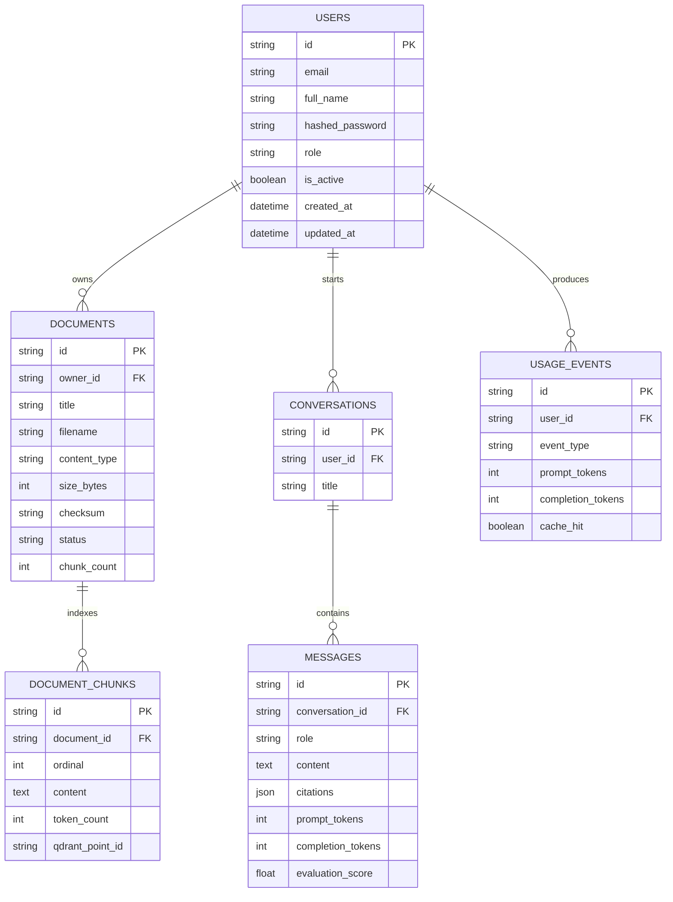

# ER Diagram

```mermaid
erDiagram
    USERS ||--o{ DOCUMENTS : owns
    USERS ||--o{ CONVERSATIONS : starts
    USERS ||--o{ USAGE_EVENTS : produces
    DOCUMENTS ||--o{ DOCUMENT_CHUNKS : indexes
    CONVERSATIONS ||--o{ MESSAGES : contains

    USERS {
      string id PK
      string email
      string full_name
      string hashed_password
      string role
      boolean is_active
      datetime created_at
      datetime updated_at
    }
    DOCUMENTS {
      string id PK
      string owner_id FK
      string title
      string filename
      string content_type
      int size_bytes
      string checksum
      string status
      int chunk_count
    }
    DOCUMENT_CHUNKS {
      string id PK
      string document_id FK
      int ordinal
      text content
      int token_count
      string qdrant_point_id
    }
    CONVERSATIONS {
      string id PK
      string user_id FK
      string title
    }
    MESSAGES {
      string id PK
      string conversation_id FK
      string role
      text content
      json citations
      int prompt_tokens
      int completion_tokens
      float evaluation_score
    }
    USAGE_EVENTS {
      string id PK
      string user_id FK
      string event_type
      int prompt_tokens
      int completion_tokens
      boolean cache_hit
    }
```

