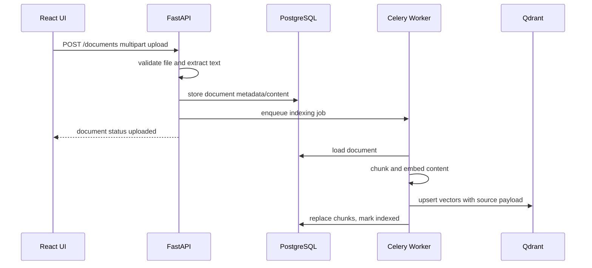
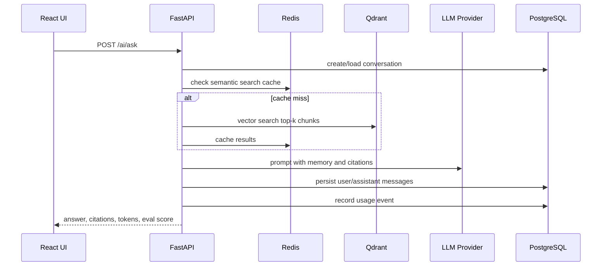

# Sequence Diagrams

## Document Indexing

```mermaid
sequenceDiagram
    participant UI as React UI
    participant API as FastAPI
    participant PG as PostgreSQL
    participant Worker as Celery Worker
    participant Q as Qdrant

    UI->>API: POST /documents multipart upload
    API->>API: validate file and extract text
    API->>PG: store document metadata/content
    API->>Worker: enqueue indexing job
    API-->>UI: document status uploaded
    Worker->>PG: load document
    Worker->>Worker: chunk and embed content
    Worker->>Q: upsert vectors with source payload
    Worker->>PG: replace chunks, mark indexed
```

## Ask AI

```mermaid
sequenceDiagram
    participant UI as React UI
    participant API as FastAPI
    participant Redis
    participant Q as Qdrant
    participant LLM as LLM Provider
    participant PG as PostgreSQL

    UI->>API: POST /ai/ask
    API->>PG: create/load conversation
    API->>Redis: check semantic search cache
    alt cache miss
        API->>Q: vector search top-k chunks
        API->>Redis: cache results
    end
    API->>LLM: prompt with memory and citations
    API->>PG: persist user/assistant messages
    API->>PG: record usage event
    API-->>UI: answer, citations, tokens, eval score
```

